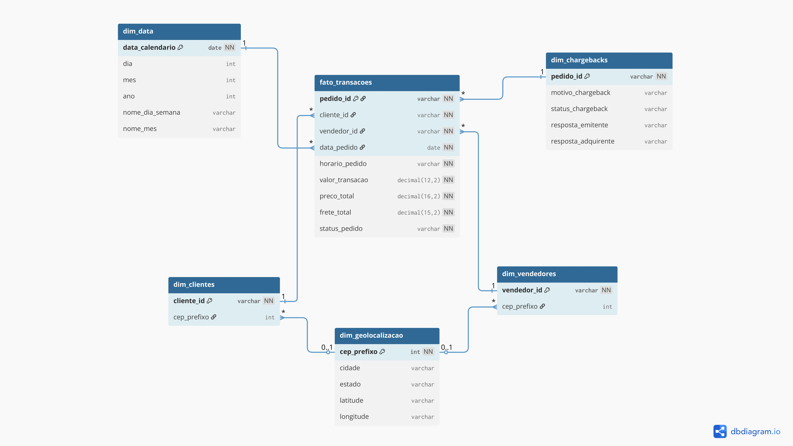

<h1 align="center">MVP de Engenharia de Dados</h1>

  
  
  
  
  
  
  
  

  <em>Projeto de sprint da Pós-graduação em Data Science & Analytics (PUC-Rio) focado em engenharia de dados e arquitetura Lakehouse.</em>

***

## 🎯 Visão geral

Projeto desenvolvido como parte da **sprint de Engenharia de Dados** do programa de **Pós-graduação em Data Science \& Analytics da PUC-Rio**, pensado para compor o portfólio com um caso completo de pipeline analítico em ambiente de Data Lakehouse.
O MVP simula o pipeline transacional da **100cep Gateway**, cobrindo ingestão, processamento, conciliação e chargebacks, com foco em boas práticas de modelagem, governança e observabilidade de dados.

**Este repositório demonstra:**

- Arquitetura **Lakehouse** com camadas **Bronze → Silver → Gold**.
- Construção de um **esquema estrela** para análise de risco, antifraude e receita.
- Documentação técnica (catálogo, ETL, análises, autoavaliação) em formato pronto para portfólio.

***

## 🏛️ Sobre a 100cep Gateway

  

A **100cep Gateway** é uma empresa fictícia de infraestrutura de pagamentos *borderless*, especializada em processar pagamentos globais de forma rápida, segura e interoperável.
O conceito **“100cep”** remete à ausência de barreiras de cidade, estado ou país, reforçando o foco em análises por região, método de pagamento e risco de chargeback.

***

## 🎓 Contexto acadêmico e objetivos

Este projeto foi desenvolvido no contexto da pós-graduação em **Data Science \& Analytics (PUC-Rio)**, com foco em engenharia de dados aplicada.

**Objetivos principais:**

- **Pipeline transacional**
Simular o fluxo de uma adquirente/gateway, ingerindo e organizando dados de pedidos, pagamentos, itens, clientes e sellers.
- **Visões analíticas de risco**
Criar camadas analíticas para monitorar chargebacks, GMV, ticket médio e métricas por método de pagamento, seller e localização.
- **Portfólio técnico**
Entregar código + documentação, evidenciando decisões de arquitetura, qualidade de dados e modelagem dimensional.

***

## 🧱 Stack técnica

- **Plataforma de dados:** Databricks (Spark, Delta Lake, Unity Catalog).
- **Linguagem:** Python.
- **Processamento:** Apache Spark (SQL / DataFrames) e Pandas para análises pontuais.
- **Modelagem:** Arquitetura Medallion (Bronze, Silver, Gold) e esquema estrela.
- **Visualização:** Seaborn / Matplotlib e ferramentas de BI consumindo tabelas Gold.

***

## 📦 Dados utilizados

Os dados são baseados no **Brazilian E-Commerce Public Dataset by Olist**, amplamente utilizado em estudos de ciência e engenharia de dados.
O projeto também utiliza um dataset sintético de chargebacks para simular risco e fraude, sem qualquer dado sensível real.

**Fluxo de ingestão:**

1. Download dos arquivos CSV a partir do Kaggle.
2. Upload para **Unity Catalog Volumes** no Databricks, compondo a área de *staging* antes da Bronze.

> ⚠ Nenhum dado pessoal identificável (PII) real é utilizado.
> ⚠ Escopo 100% educacional e de portfólio.

***

## 🏗️ Arquitetura e modelagem

O projeto adota um modelo **Lakehouse** em Databricks, estruturado na arquitetura **Medallion** (Bronze, Silver, Gold), com governança via Unity Catalog.

### 🥉 Bronze · dados brutos

- CSVs armazenados em Delta quase “como chegaram”.
- Foco em auditabilidade e possibilidade de reprocessamento.

### 🥈 Silver · dados tratados

- Padronização de tipos e normalização de chaves.
- Tratamento de nulos e deduplicação.
- Criação de tabelas temáticas (pedidos, pagamentos, clientes, itens).

### 🥇 Gold · modelo analítico

- Dimensões: clientes, vendedores, pagamentos, data, geolocalização, chargebacks.
- Fato: `fato_transacoes`, consolidando pedidos, valores, status e vínculo com chargebacks.
- Modelagem dos dados em Star Schema.

  

***

## 📚 Catálogo de dados

O projeto inclui um **Data Catalog** documentando:

- Nome e tipo de cada coluna.
- Domínio esperado, faixas de valores e categorias.
- Descrição funcional e camada de origem.
- Linhagem Bronze → Silver → Gold.

Arquivo de referência: `docs/catalogo.md`.

***

## 🔄 Pipeline de carga (ETL / ELT)

A carga foi organizada em etapas claras, refletindo as camadas do Lakehouse.

1. **Ingestão — Bronze**
    - Leitura dos CSV a partir do Volume do Unity Catalog.
    - Persistência em tabelas Delta `*_raw`.
    - Normalização básica de nomes de colunas.
2. **Transformação — Silver**
    - Limpeza, tipagem, tratamento de nulos e deduplicação.
    - Criação de relacionamentos entre pedidos, pagamentos, itens, clientes e sellers.
3. **Modelagem — Gold**
    - Construção das dimensões e da `fato_transacoes`.
    - Preparação de visões finais para consumo em BI e notebooks analíticos.

Regras detalhadas de transformação: `docs/documentacao_etl.md`.

***

## ▶️ Como executar

> Ajuste nomes de catálogo/schema e caminhos conforme o seu workspace Databricks.

1. **Configurar ambiente**
    - Criar o catálogo `100cep_gateway` (ou adaptar nos scripts).
    - Configurar Unity Catalog e Volumes para staging.
2. **Rodar os scripts em ordem**
    - `./.databricks/pipeline/notebooks/01_preparacao.ipynb`
    - `./.databricks/pipeline/notebooks/02_download.ipynb`
    - `./.databricks/pipeline/notebooks/03_bronze.ipynb`
    - `./.databricks/pipeline/notebooks/04_silver.ipynb`
    - `./.databricks/pipeline/notebooks/05_gold.ipynb`
    - `./.databricks/pipeline/notebooks/06/qualidade.ipynb`
    - `./.databricks/pipeline/notebooks/07_perguntas.ipynb`
    - `./.databricks/pipeline/notebooks/08_catalogo.ipynb`

3. **Explorar análises**
    - Abrir `./.databricks/pipeline/notebooks/07_perguntas.ipynb` e notebooks analíticos para visualizar KPIs e responder às perguntas de negócio.

***

## 🔍 Perguntas de negócio

A camada Gold foi desenhada para responder perguntas típicas de risco, antifraude e receita em um gateway de pagamentos.

1. Qual o método de pagamento mais utilizado pelos clientes da 100cep Gateway?
2. Qual o histórico de faturamento ao longo do período analisado?
3. Qual a proporção de pedidos com e sem solicitação de chargeback?
4. Quais métodos de pagamento apresentam maior risco de chargeback?
5. Quais estados ou regiões concentram as maiores taxas de chargeback?

Detalhes das análises: `./.databricks/pipeline/notebooks/07_perguntas.ipynb`

***

## 📝 Autoavaliação e próximos passos

Como parte da sprint, o projeto inclui uma **autoavaliação** com reflexões técnicas e acadêmicas.

- O que foi cumprido dentro do escopo da sprint.
- Principais desafios (performance, modelagem, ferramentas).
- Ideias de evolução:
    - ingestão em streaming;
    - orquestração com jobs;
    - testes automatizados e data quality contínuo;
    - dashboards em produção.

Arquivo: `docs/autoavalicao.md`.

***

## 👤 Autor

**Felipe Pinheiro** — projeto desenvolvido no contexto da Pós-graduação em Data Science & Analytics (PUC-Rio).

***

## 📎 Créditos

Dataset: *[Brazilian E-Commerce Public Dataset by Olist](https://www.kaggle.com/datasets/olistbr/brazilian-ecommerce)* — Olist \& André Sionek.
DOI: *[10.34740/kaggle/dsv/195341](https://doi.org/10.34740/kaggle/dsv/195341)* — Licença *[CC BY-NC-SA 4.0](https://creativecommons.org/licenses/by-nc-sa/4.0/)*.

⁂
