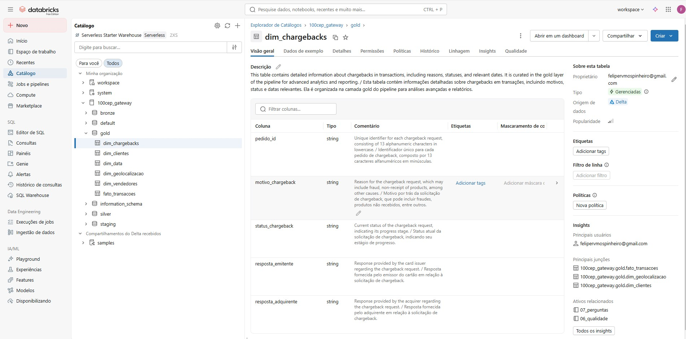
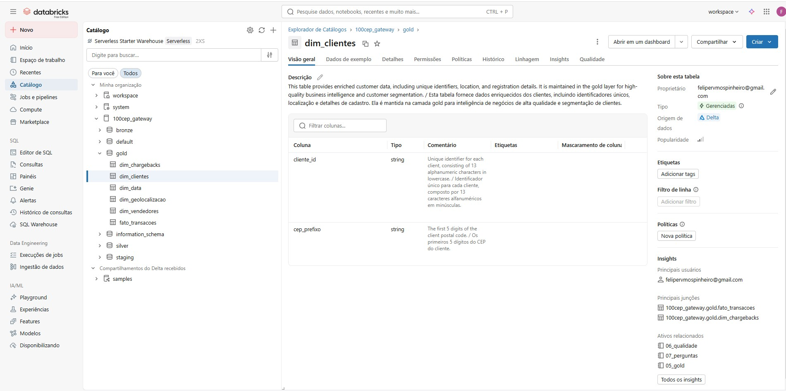
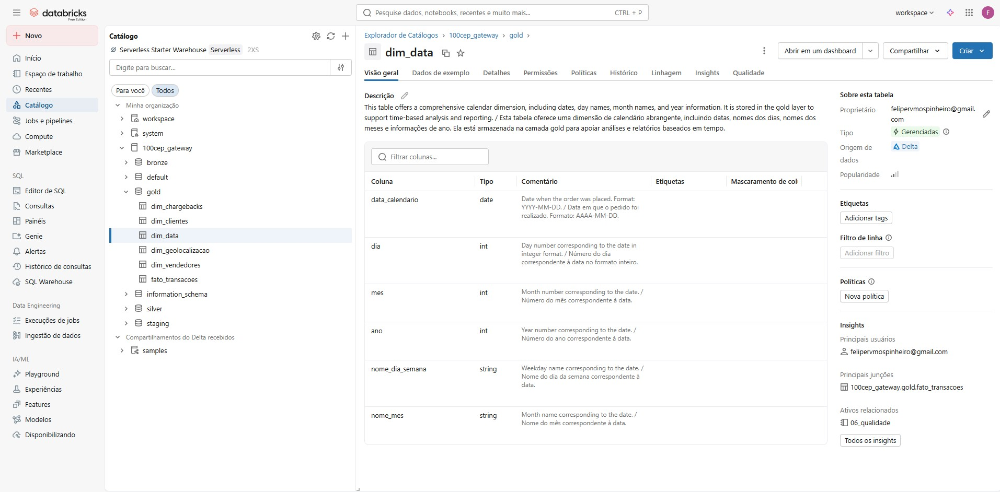
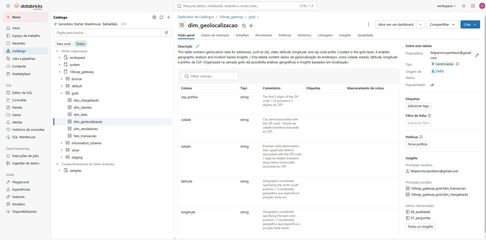
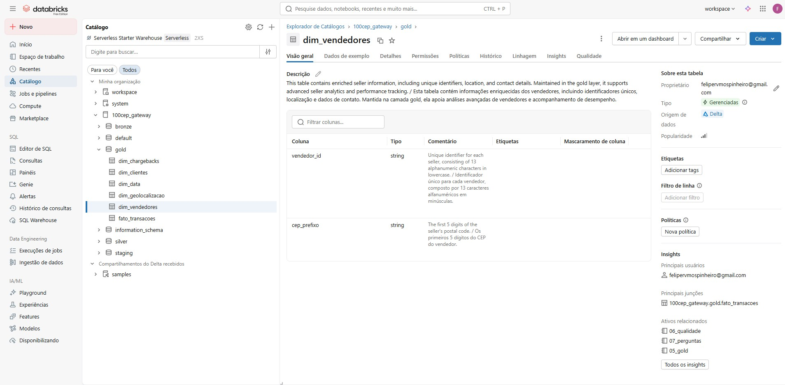
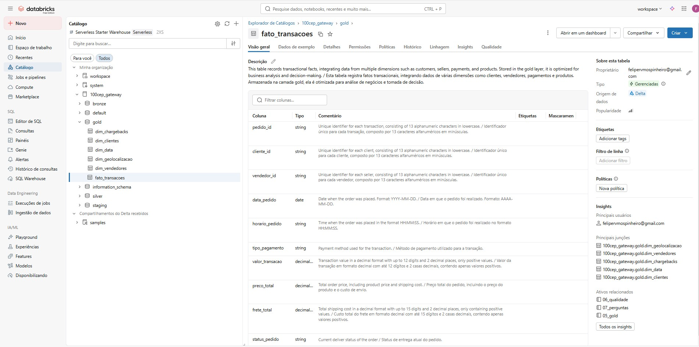

<h1 align="center">Catálogo de Dados</h1>

<h2 align="center">dim_chargebacks</h2>

 

| Coluna | Tipo | Descrição 
| ------ | ---- | --------- 
| pedido_id | string | Identificador único para cada pedido de chargeback, composto por 13 caracteres alfanuméricos em minúsculas. | 
| motivo_chargeback | string | Motivo por trás da solicitação de chargeback, que pode incluir fraudes, produtos não recebidos, entre outros. | 
| status_chargeback | string | Status atual da solicitação de chargeback, indicando seu estágio de progresso.  | 
| resposta_emitente | string | Resposta fornecida pelo emissor do cartão em relação à solicitação de chargeback. | 
| resposta_adquirente | string | Resposta fornecida pelo adquirente em relação à solicitação de chargeback. | 

<h2 align="center">dim_clientes</h2>

 

| Coluna | Tipo | Descrição 
| ------ | ---- | --------- 
| cliente_id | string | Identificador único para cada cliente, composto por 13 caracteres alfanuméricos em minúsculas. | 
| cep_prefixo | string | Os primeiros 5 dígitos do CEP do cliente. | 

<h2 align="center">dim_data</h2>

 

| Coluna | Tipo | Descrição 
| ------ | ---- | --------- 
| data_calendario | date | Data em que o pedido foi realizado. Formato: AAAA-MM-DD.| 
| dia | int | Número do dia correspondente à data no formato inteiro. | 
| mes | int | Número do mês correspondente à data. | 
| ano | int | Número do ano correspondente à data. | 
| nome_dia_semana | string | Nome do dia da semana correspondente à data. | 
| nome_mes | string | Nome do mês correspondente à data. | 

<h2 align="center">dim_geolocalizacao</h2>

 

| Coluna | Tipo | Descrição 
| ------ | ---- | --------- 
| cep_prefixo | string | Os primeiros 5 dígitos do CEP. | 
| cidade | string | Nome da cidade brasileira associada ao CEP. | 
| estado | string | Sigla do estado brasileiro (duas letras maiúsculas) associada ao CEP. | 
| latitude | string | Coordenada geográfica que especifica a posição norte-sul. | 
| longitude | string | Coordenada geográfica que especifica a posição leste-oeste. | 

<h2 align="center">dim_vendedores</h2>

 

| Coluna | Tipo | Descrição 
| ------ | ---- | --------- 
| vendedor_id | string | Identificador único para cada vendedor, composto por 13 caracteres alfanuméricos em minúsculas. | 
| cep_prefixo | string | Os primeiros 5 dígitos do CEP do vendedor. | 

<h2 align="center">fato_transacoes</h2>

 

| Coluna | Tipo | Descrição 
| ------ | ---- | --------- 
| pedido_id | string | Identificador único para cada transação, composto por 13 caracteres alfanuméricos em minúsculas. | 
| cliente_id | string | Identificador único para cada cliente, composto por 13 caracteres alfanuméricos em minúsculas. | 
| vendedor_id | string | Identificador único para cada vendedor, composto por 13 caracteres alfanuméricos em minúsculas. | 
| data_pedido | date | Data em que o pedido foi realizado. Formato: AAAA-MM-DD. | 
| horario_pedido | date | Horário em que o pedido foi realizado no formato HH:MM:SS.| 
| tipo_pagamento | string | Método de pagamento utilizado para a transação.| 
| valor_transacao | decimal(12,2) | Valor da transação em formato decimal com até 12 dígitos e 2 casas decimais, contendo apenas valores positivos. | 
| preco_total | decimal(16,2) | Preço total do pedido, incluindo o preço do produto e o custo de envio. | 
| frete_total | decimal(15,2) | Custo total do frete em formato decimal com até 15 dígitos e 2 casas decimais, contendo apenas valores positivos. |
| status_pedido | string | Status de entrega atual do pedido. | 